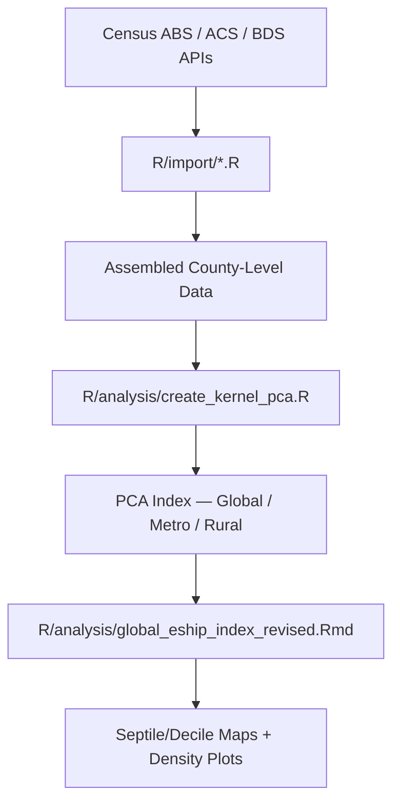

## Project Overview

The Capital One Business Demographics Analysis project provides CORI's analytical framework for examining U.S. business ownership demographics and entrepreneurship activity at the county level. The project has two primary components: (1) a demographic analysis of employer firm ownership by sex, ethnicity, race, and veteran status using the Census Annual Business Survey (ABS) 2022, and (2) a county-level entrepreneurship index built from ACS, BDS, and geographic data using kernel Principal Component Analysis (PCA). The latter produces global, metro, and rural index variants with septile and decile classification maps.

::: {.callout-tip icon=false}
## Quick Links

- [GitHub Repository](https://github.com/ruralinnovation/proj-capitalone)
- [S3 Client Bucket](https://us-east-1.console.aws.amazon.com/s3/buckets/proj-capitalone)
:::

## Key Questions

::: {.panel-tabset}

### Business Ownership Demographics

What share of U.S. employer firms are owned by women, veterans, Hispanic/Latino, and minority-owned businesses? How do revenues and employment compare across ownership demographics?

### County Entrepreneurship Index

Which counties rank highest on entrepreneurship activity nationally? How does the index vary between rural and metro geographies?

### Index Methodology Validation

How robust is the PCA-based entrepreneurship index across different kernel methods and temporal windows (single-year vs. 3-year average)?

### Rural vs. Metro Comparison

How does rural entrepreneurship activity compare to metro, and which rural counties perform above expectations?

:::

## Methodology

::: {.callout-note}
## Analytical Approach

ABS demographic analysis uses 2022 Annual Business Survey tables (employer firms by sex, ethnicity, race, and veteran status). The entrepreneurship index uses kernel PCA on ACS-derived variables (business entry rates, self-employment, proprietor income shares) with robustness testing across kernel methods and year windows.
:::

### ETL Pipeline

:::: {.columns}

::: {.column width="48%"}
### Geographic Classification

CBSA 2023 via `ruraldefinitions` package for rural/metro split; USDA ERS County Typology for economic specialization stratification.
:::

::: {.column width="4%"}
:::

::: {.column width="48%"}
### Temporal Coverage

ABS: 2022 vintage. ACS: 5-year estimates. BDS: through latest available vintage. Entrepreneurship index: single-year (2023) and 3-year average variants.
:::

::::

## Data Sources & Integration

### Business Ownership Demographics

| Dataset | Variables | Years | Key Metrics |
|---------|-----------|-------|-------------|
| [American Community Survey 5-Year](/datasets/american-community-survey/) | Business entry rates, self-employment, proprietor income | 2018, 2023 | PCA component inputs |
| [Business Dynamics Statistics](/datasets/census-bds/) | Establishment entry/exit rates, firm counts | 2010–2023 | Entrepreneurship index components |
| [USDA ERS County Typology](/datasets/usda-county-typology/) | Economic specialization, persistent poverty | 2025 | Stratification variable |
| Census Annual Business Survey *(slug: `census-abs` — node pending)* | Employer firms by sex, ethnicity, race, veteran status | 2022 | Ownership demographics baseline |

## Technical Implementation

### Data Quality Controls

::: {.callout-note}
## Quality Assurance Process

Kernel diagnostics applied to validate PCA stability across methods; septile and decile classifications compared for consistency; density plots generated to inspect index distribution before final output.
:::

### Reproducibility

Modular ETL in `R/import/` per source; analysis scripts in `R/analysis/` for index construction; `R/final_viz/` for publication-ready maps and charts; `R/utils/pca_output_utils.R` centralizes plot export utilities.

## Outputs

::: {.panel-tabset}

### Analysis Outputs

- Global entrepreneurship index by county — septile and decile classifications (2023)
- Metro entrepreneurship index by county
- Rural entrepreneurship index by county
- Kernel PCA diagnostics and robustness comparisons

### Visualizations

- Density plot of robust hybrid PCA distribution (2023) — `R/utils/pca_output_utils.R`
- Histogram of robust PCA septile classification (2023) — `R/analysis/kernel_diagnostics.R`
- Decile robust PCA county map (2023) — `R/analysis/global_eship_index_revised.Rmd`
- Global entrepreneurship index septile map (2022) — `R/analysis/global_eship_index_map_revised.Rmd`
- Global entrepreneurship index septile map (latest) — `R/analysis/global_eship_index_map_revised.Rmd`
- Robust PCA septile map (2023) — `R/analysis/global_eship_index_revised.Rmd`

:::

## R Packages

| Package | Purpose |
|---------|---------|
| [cori.data.bds](/packages/cori-data-bds/) | S3-backed access layer for Business Dynamics Statistics |
| [ruraldefinitions](/packages/ruraldefinitions/) | Rural/nonrural county classification (CBSA 2023) |

::: {.callout-note}
## Dangling references

The following slugs are referenced by this project but do not yet have nodes in Dataverse. They are intentionally preserved as future content needs:

- `dataset/census-abs`
:::
