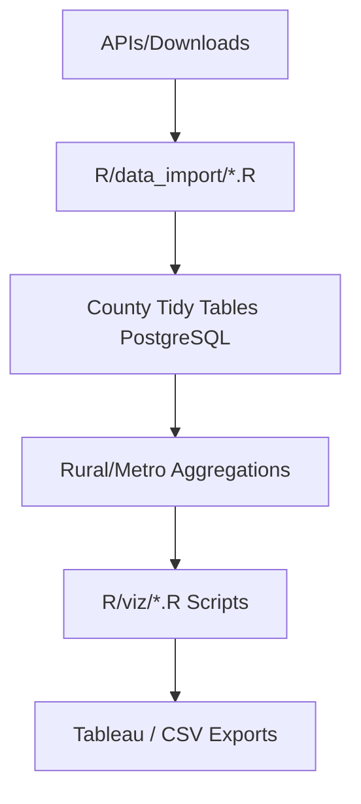

## Project Overview

The Rural Economic Outlook project is a comprehensive data pipeline integrating 12 federal datasets at county level to compare rural vs. metropolitan economic performance from 2007 to 2024. Built to support CORI's February 2026 Rural Economic Outlook webinar, it tracks economic momentum, labor markets, industry structure, entrepreneurship, remote work, broadband, and housing affordability across 3,100+ U.S. counties.

::: {.callout-tip icon=false}
## Quick Links

- [GitHub Repository](https://github.com/ruralinnovation/data-rural-economic-outlook)
- Database Schema: `proj_rural_economic_outlook`
:::

## Key Questions

::: {.panel-tabset}

### Macro Conditions

How has rural GDP per capita grown compared to metro since the Great Recession?

### Labor Markets

Are rural areas facing labor shortages? What are employment and wage trends by sector?

### Industry Structure

How concentrated are rural economies? Which sectors are growing or declining?

### Business Dynamics

Are rural areas creating new businesses? What role do young firms play in job creation?

### Tech and Remote Work

How has remote work changed rural labor markets? Where are tech jobs located?

### Cost Pressures

How are housing affordability, migration, and local fiscal capacity evolving?

### Forward Outlook

What do leading indicators suggest about rural conditions in 2026-2028?

:::

## Methodology

::: {.callout-note}
## Data Integration Strategy

Tidy architecture: one row per county per year per variable. BEA county employment tables deprecated after 2022; QCEW bridges 2023-2024. Momentum indices baseline 2007 (pre-Great Recession = 100).
:::

### ETL Pipeline

:::: {.columns}

::: {.column width="48%"}
### Geographic Classification

CBSA 2023 via ruraldefinitions package for primary rural/nonrural split; USDA ERS County Typology (2025) for economic specialization; NCHS 6-category for broadband and remote work.
:::

::: {.column width="4%"}
:::

::: {.column width="48%"}
### Temporal Coverage

2007-2024 (full). ACS cross-sections: 2013, 2018, 2023. IRS migration: 2007-2022. BEA GDP: 2007-2023. PEP components: 2000-2023.
:::

::::

### Inflation Adjustment

::: {.callout-note}
## Price Adjustment Methods

All monetary values in 2023 dollars. BEA GDP: chain-weighted 2017 dollars (pre-adjusted). QCEW wages and IRS AGI: BLS CPI-U-RS deflation. Deflator dataset pending Dataverse node (bls-cpi-deflators).
:::

## Data Sources & Integration

### Demographics and Population

| Dataset | Variables | Years | Key Metrics |
|---------|-----------|-------|-------------|
| [Census Population Estimates](/datasets/census-population-estimates/) | Population totals, age structure | 2007-2024 | Per-capita denominators, rural population trends |
| [Census PEP Components of Change](/datasets/census-pep-components/) | Births, deaths, domestic/international migration | 2000-2023 | Natural increase vs. migration drivers |
| [American Community Survey 5-Year](/datasets/american-community-survey/) | Demographics, labor, housing, occupations (88 variables) | 2013, 2018, 2023 | Prime-age employment, remote work, cost burden, education |

### Economic Output and Labor

| Dataset | Variables | Years | Key Metrics |
|---------|-----------|-------|-------------|
| [BEA Real GDP Per Capita](/datasets/bea-real-gdp/) | Real GDP per capita (CAGDP1) | 2007-2023 | Economic growth momentum index (2007=100) |
| [QCEW Employment and Wages](/datasets/qcew-employment-wages/) | Employment, wages, industry detail by NAICS | 2007-2024 | Real wage growth, sectoral shifts, industry concentration (HHI) |

### Business Dynamics and Entrepreneurship

| Dataset | Variables | Years | Key Metrics |
|---------|-----------|-------|-------------|
| [Business Dynamics Statistics](/datasets/census-bds/) | Entry/exit rates, job creation by firm age | 2007-2023 | Young firm job creation share, business dynamism |
| [Business Formation Statistics](/datasets/census-bfs/) | Business applications (BA, HBA) | 2007-2024 | Leading indicator of entrepreneurship activity |

### Migration, Housing, and Innovation

| Dataset | Variables | Years | Key Metrics |
|---------|-----------|-------|-------------|
| [IRS SOI County-to-County Migration](/datasets/irs-migration/) | County-to-county flows, AGI migration by age cohort | 2007-2022 | Net migration rates, income flows by age group |
| [Building Permits Survey](/datasets/census-building-permits/) | Housing units authorized | 2007-2024 | Housing supply per 1,000 population |
| [USPTO Patents](/datasets/uspto-patents/) | Patent counts by assignee location | 2014-2024 | Innovation activity per capita |

### Classification and Infrastructure

| Dataset | Variables | Years | Key Metrics |
|---------|-----------|-------|-------------|
| [USDA ERS County Typology](/datasets/usda-county-typology/) | Economic specialization, persistent poverty codes | 2025 | Stratification variable for typology analysis |
| [FCC National Broadband Map](/datasets/fcc-broadband/) | Broadband availability by technology and speed tier | 2025 | Digital infrastructure coverage by rural category |
| BLS CPI Deflators *(slug: `bls-cpi-deflators` -- node pending)* | CPI-U-RS annual deflator series | 2007-2024 | Inflation adjustment for wages and AGI |

## Technical Implementation

### Data Quality Controls

::: {.callout-note}
## Quality Assurance Process

Variable count assertions (ACS: 88 variables); geographic coverage checks (3,100+ counties); CPI-U-RS deflation verified; explicit NA treatment for cost burden and occupation share variables.
:::

### Reproducibility

Modular ETL in R/data_import/ per source; params.yml centralizes config; renv.lock pins versions; DATA_CODEBOOK.csv documents all variables.

## Outputs

::: {.panel-tabset}

### Data Products (Status: in development)

- County-level tidy tables in PostgreSQL (proj_rural_economic_outlook)
- Rural/metro aggregations by CBSA classification
- 27 chart-ready datasets for webinar — export/ contains README only; no files on disk yet
- Excel export: Rural Innovation.xlsx

### Visualizations (Status: in development)

- GDP growth indices (2007=100) — gdp_change_lc.R
- Employment change line charts — emp_change_lc.R
- Real wage trends — wage_change_lc.R
- Business entry rates — biz_entry_region_lc.R
- Net domestic migration — net_migration_lc_domestic_only.R
- Broadband availability bars — fiber_share_grouped_bar.R
- Remote work density — remote_work_density_plot.R
- County typology maps — ers_farming/manufacturing/mining_map.R

:::

## R Packages

| Package | Purpose |
|---------|---------|
| [cori.data.bds](/packages/cori-data-bds/) | S3-backed access layer for Business Dynamics Statistics |
| [cori.data.fcc](/packages/cori-data-fcc/) | S3-backed access layer for FCC National Broadband Map data |
| [ruraldefinitions](/packages/ruraldefinitions/) | Rural/nonrural county classification (CBSA 2023 and other definitions) |

The following slugs are not yet in Dataverse: bls-cpi-deflators

