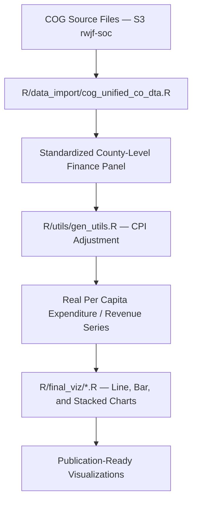

## Project Overview

The RWJF Seeds of Change Public Funding Analysis examines how local government revenues and expenditures have changed across U.S. counties from 1977 to 2022, with a focus on rural–urban disparities. Using Census of Governments (COG) microdata aggregated to the county level, the project tracks per capita trends in direct expenditures, intergovernmental revenues (federal and state), and tax revenues across functional categories including housing, transportation, health, education, public welfare, and utilities. All financial values are inflation-adjusted to 2023 dollars using BLS CPI deflators. Geographic stratification uses rural definitions from CBSA and CDC classifications, persistent poverty county designations, Social Vulnerability Index (SVI) tiers, and tribal area status.

::: {.callout-tip icon=false}
## Quick Links

- [GitHub Repository](https://github.com/ruralinnovation/proj_rwjf_soc_2_public_funding)
- [S3 Data Bucket](https://us-east-1.console.aws.amazon.com/s3/buckets/rwjf-soc)
:::

## Key Questions

::: {.panel-tabset}

### Revenue Trends

How have total revenues, own-source revenues, and intergovernmental transfer revenues (federal and state) changed per capita across rural and metro counties from 1977 to 2022?

### Expenditure Patterns

Which expenditure categories have grown or declined in real per capita terms? How do rural counties compare to metro counties across functional spending categories (health, education, public welfare, transportation, housing, utilities)?

### Persistent Poverty & Vulnerability

Do persistently poor counties and high-SVI counties show systematically different public funding trajectories than comparable counties without those designations?

### Tax Revenue Composition

How has the composition of local tax revenues (property, sales, individual income, corporate income) shifted over time, and does this shift differ by rurality?

:::

## Methodology

::: {.callout-note}
## Analytical Approach

COG financial microdata are downloaded from S3 (`rwjf-soc` bucket), standardized across five government types (county, township, municipal, special district, school district), and aggregated to county FIPS. All values are inflation-adjusted to 2023 dollars using BLS CPI-U-RS deflators. Per capita denominators use ACS population estimates. Geographic stratification applies CBSA 2023 metro/nonmetro definitions via the `ruraldefinitions` package, with supplemental CDC SVI tiers and USDA persistent poverty designations.
:::

### ETL Pipeline

:::: {.columns}

::: {.column width="48%"}
### Geographic Classification

CBSA 2023 via `ruraldefinitions` package for rural/metro split; CDC SVI for vulnerability tiers; persistent poverty county flags and tribal area status for equity-focused stratification.
:::

::: {.column width="4%"}
:::

::: {.column width="48%"}
### Temporal Coverage

Census of Governments: 1977–2022 (quinquennial surveys with interpolation). CPI deflation to 2023 dollars using BLS CPI-U-RS. ACS 5-year estimates for per capita denominators.
:::

::::

## Data Sources & Integration

| Dataset | Variables | Years | Key Metrics |
|---------|-----------|-------|-------------|
| [American Community Survey 5-Year](/datasets/american-community-survey/) | Population totals | 2018, 2023 | Per capita denominators |
| Census of Governments *(slug: `census-of-governments` — node pending)* | Revenues, expenditures by function and government type | 1977–2022 | Primary financial data source |
| BLS CPI Deflators *(slug: `bls-cpi-deflators` — node pending)* | CPI-U-RS price index | 1977–2023 | Inflation adjustment to 2023 dollars |
| CDC Social Vulnerability Index *(slug: `cdc-svi` — node pending)* | SVI composite and theme scores | 2020, 2022 | Geographic stratification variable |

## Technical Implementation

### Repository Structure

Modular ETL in `R/data_import/` per COG file type (unified county, tax, service charges); utility functions in `R/utils/` for CPI adjustment (`gen_utils.R`), COG-specific cleaning (`cog_utils.R`, `cog_tax_utils.R`), and chart styling; exploration scripts in `R/exploration/` for EDA; finalized visualizations in `R/final_viz/` following a consistent naming convention (letter-number prefix keyed to deliverable order).

### Data Quality Controls

::: {.callout-note}
## Quality Assurance Process

West Virginia county-level validation (`R/analysis/cog_wv_validation.Rmd`, `R/analysis/revised_cog_wv_validation.Rmd`) provides ground-truth comparison of COG aggregates against independently sourced state finance records. COG totals are reconciled against cross-tabulations by government type before final analysis.
:::

### Database

County typology and geographic classification data are accessed via the `proj_rwjf_soc` PostgreSQL schema, consistent with the broader SOC project infrastructure.

## Outputs

::: {.panel-tabset}

### Analysis Outputs

- Per capita direct expenditure trends by rurality (1977–2022)
- Per capita total revenue and own-source revenue trends
- Federal and state intergovernmental revenue trends by rurality
- Expenditure subcategory shares as percent of total (housing, transportation, health, education, public welfare, utilities)
- Tax revenue composition trends (property, sales, income taxes)
- Expenditure distributions by persistent poverty and SVI tier

### Visualizations

- Line charts: direct expenditure, total revenue, public welfare, federal IGR, state IGR, transportation, utilities, education, health/hospitals, housing, property/sales/income taxes — `R/final_viz/`
- Bar charts: taxes by rurality, expenditures by rurality, persistent poverty expenditure training — `R/final_viz/`
- Stacked bar: direct expenditure composition — `R/final_viz/F6_create_stacked_bar_direct_expenditures.R`

:::

## R Packages

| Package | Purpose |
|---------|---------|
| [ruraldefinitions](/packages/ruraldefinitions/) | Rural/nonrural county classification (CBSA 2023) |

::: {.callout-note}
## Dangling references

The following slugs are referenced by this project but do not yet have nodes in Dataverse. They are intentionally preserved as future content needs:

- `dataset/census-of-governments`
- `dataset/bls-cpi-deflators`
- `dataset/cdc-svi`
:::
